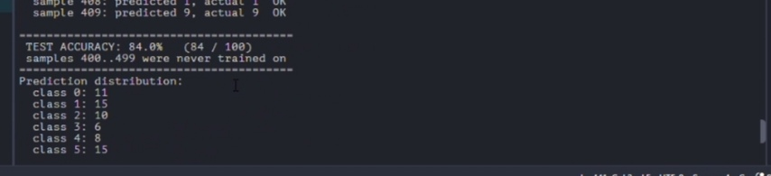
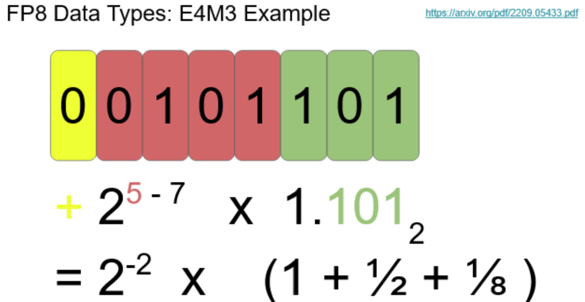
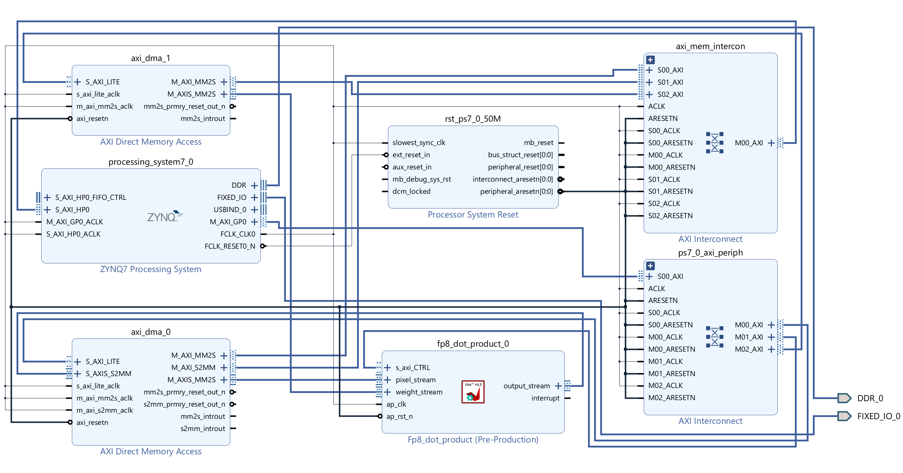

# FP8 Neural Network Accelerator on the Zynq-7020

A convolutional neural network trained and evaluated on a Zynq-7020 development board, with the
dot-product arithmetic offloaded to a custom accelerator in the programmable logic. Values are
stored in an 8-bit floating-point format (E4M3) and computed in 24-bit fixed point.

**Result: 84.0% classification accuracy on 100 samples held out from training.**



---

## Overview

Inference on the ARM cores alone was too slow to complete enough training passes in a practical
time. Moving the dot product into the FPGA fabric made the required number of passes feasible.

The accelerator computes a streaming dot product. The bare-metal application on the ARM core
drives it through two DMA engines, performs the pooling and the classifier update in software,
and reports the final accuracy over the serial port.

| | |
|---|---|
| Board | Zynq-7000 SoC, XC7Z020 |
| Accelerator | Vitis HLS 2024.1 |
| System | Vivado IP Integrator |
| Software | Bare-metal C, Vitis Unified IDE |
| Serial | 115200 baud |

---

## Number format

Values are stored as E4M3: one sign bit, four exponent bits (bias 7), three mantissa bits.



Storage and arithmetic use different representations:

- **Storage in E4M3.** One byte per value, which reduces both memory footprint and bus traffic.
- **Arithmetic in fixed point.** Floating-point addition requires operand alignment and
  renormalisation, which cost fabric and latency. Values are converted to `ap_fixed<24,12>` on
  entry to the accumulation loop and converted back on exit.

The 24-bit width applies only inside the arithmetic unit, so it costs no storage. Twelve
fractional bits resolve to 0.00024, below the 0.0156 lower limit of E4M3, so intermediate
values are not lost to underflow during accumulation.

---

## Architecture



- `fp8_dot_product_0` — the HLS accelerator. Two AXI4-Stream inputs, one output, AXI4-Lite control.
- `axi_dma_0` — supplies image pixels and receives the result.
- `axi_dma_1` — supplies weights.
- `axi_mem_intercon` — carries the three DMA memory-mapped masters to the `S_AXI_HP0` port.

Three independent paths connect the processing system to the fabric: AXI4-Lite for control,
AXI4-Stream for data, and AXI4 memory-mapped for DDR access. All three must be connected; if any
one is missing the system stalls with no error reported.

---

## Repository contents

```
hls/E4M3_Datatype.cpp     accelerator source for Vitis HLS
src/helloworld.c          bare-metal application
src/mnist_data.h          dataset (500 samples)
docs/                     figures
```

---

## Build

**1. Accelerator**

Open `hls/E4M3_Datatype.cpp` in Vitis HLS, set `fp8_dot_product` as the top function, run
C synthesis, then Export RTL as IP.

**2. System**

In Vivado, add the exported IP to the repository and build the block design as shown above.
Then:

- Enable `S_AXI_HP0` on the processing system at 64-bit width.
- Set the stream data width to **8 bits** on all DMA stream ports.
- Enable **Allow Unaligned Transfers** on all channels.
- Disable Scatter Gather.
- Run **Assign All** in the Address Editor and confirm no unassigned segments.
- Run **Validate Design** and read any critical warnings before generating the bitstream.

Generate the bitstream and export the hardware with the bitstream included.

**3. Application**

Create a platform from the exported XSA, build the application from `src/`, program the device,
and open a serial terminal at 115200 baud.

---

## Verification

The application performs a fixed check at startup: sixteen multiplications of 1.0 by 1.0, for
which the correct result is 16.0, encoded as `0x58`. Execution halts on mismatch.

```
Sanity: 0x58 (expect 0x58)
```

This single byte exercises the whole path — DDR reads on both engines, both input streams, the
arithmetic unit, the end-of-packet marker, and the write back to DDR.

---

## Notes

- Only the classifier stage is trained on the board. The convolution filters are randomly
  initialised and held fixed.
- Weights are scaled by a power of two before encoding, since the values are otherwise below the
  E4M3 lower limit and encode to zero. The scale factor is selected at run time and divided out
  in software.
